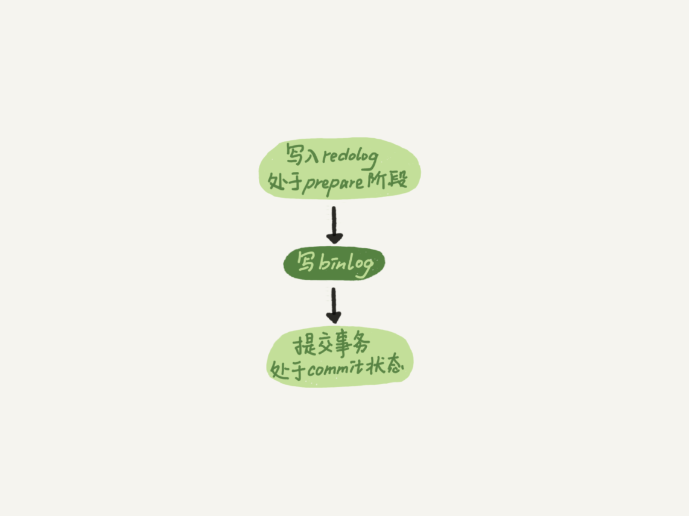

## WAL(Write-Ahead Logging)

磁盘随机读写很耗费性能，所以引入了WAL技术，即先写日志，再写原始数据。写日志采用顺序写，相比随机IO性能提高很多。

InnoDB的日志文件称为redo log，ib_logfile_0、ib_logfile_1这些就是redo log文件，redo log文件总大小是固定的。

checkpoint：该点之前的日志已经写入原始数据文件。

write pos：当前redo log写入的位置，随着redo log的写入不断前移。

## binlog

redo log是InnoDB引擎特有的日志，提供crash-safe的能力（崩溃恢复）。MySQL Server层也有自己的日志，称为binlog（归档日志）。binlog常用于数据恢复、主从复制等场景。

redo log和binlog对比：

1. redo log是InnoDB引擎特有的；binlog在Server实现，所有引擎都能使用。
2. redo log记录的是物理日志，即某个数据页上做了什么修改；binlog记录的是逻辑日志，有三种格式：statement、row和mixed。
3. redo log是循环写，空间固定；binlog追加写，文件达到一定大小后切换到新的文件。

**binlog日志格式**

- statement格式记录原始sql语句，但sql在主备上执行结果可能有差异（如选用了不同的索引，操作的记录就可能不相同），造成主备数据不一致。

- row格式会记录原始行数据，update会记录更新前和更新后的行内容，delete会记录删除的行内容，insert会记录插入的行内容。这种记录方式不会造成主备数据不一致，缺点是占用较大磁盘空间，耗费IO资源，影响执行速度。

- mixed格式，对可能引起主备不一致的sql使用row格式，否则用statement格式。

生产环境推荐设置为row格式，因为row格式能保证主备数据一致，而且记录了原始行能很容易恢复数据。

## 两阶段提交

为了保证redo log和binlog的数据一致性，采用两阶段提交。

redo log和binlog都有一个XID字段，崩溃恢复时，顺序扫描redo log：

- 如果事务日志包含prepare和commit日志，直接提交。
- 如果只有prepare日志，没有commit日志，用XID去binlog查找，binlog中有完整的日志则提交，否则回滚。

## redo log刷盘机制

write指的是把日志写入文件系统的page cache，并没有把数据持久化到磁盘，所以速度较快。fsync才是将数据持久化到磁盘的操作，一般认为fsync才占磁盘的IOPS。

redo log buffer是暂存redo log的一块内存区域，该块内存的刷盘机制由innodb_flush_log_at_trx_commit控制。

- innodb_flush_log_at_trx_commit=0，每次事务提交不刷盘，redo log仍保留在redo log buffer中；
- innodb_flush_log_at_trx_commit=1，每次事务提交都执行fsync；
- innodb_flush_log_at_trx_commit=2，每次事务提交只执行write，不执行fsync；

除了事务提交的刷盘机制，InnoDB还有一个后台线程，每隔一秒对redo log buffer的数据调用write+fsync进行持久化。

## binlog刷盘机制

binlog cache是暂存binlog的一块内存区域，每个线程都有一块独立的binlog cache。该块内存的刷盘机制由sync_binlog控制。

- sync_binlog=0，每次提交事务只write，不fsync；
- sync_binlog=1，每次提交事务都会执行fsync；
- sync_binlog=N(N>1)，每次提交事务都会write，但累计N个事务后才fsync。

## 最佳实践

双1配置：innodb_flush_log_at_trx_commit=1 + sync_binlog=1

innodb_flush_log_at_trx_commit=1，保证事务提交后不丢失数据。不建议设置为0，因为数据在内存中，MySQL宕机和主机宕机都会丢失数据。设置为2，可提高性能，通常用于应对突发的高流量场景，主机宕机会丢失数据。

sync_binlog=1，保证事务提交后不丢数据。不建议设置为0，因为主机宕机后数据丢失量不可控。设置为N，可提高性能，但主机宕机后会丢失最近N个事务的binlog日志。

公司实践：innodb_flush_log_at_trx_commit=1 + sync_binlog=0。

*Ref*

- 02讲日志系统：一条SQL更新语句是如何执行的
- 15讲答疑文章（一）：日志和索引相关问题
- 23讲MySQL是怎么保证数据不丢的

