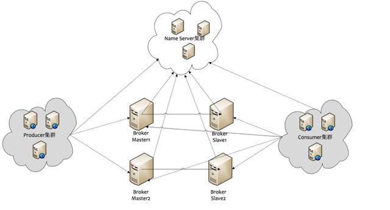

# RocketMQ 高可用

## RocketMQ架构

**NameServer**

担任注册中心的角色，Broker将Topic信息注册到NameServer，并定时发送心跳。

Producer、Consumer和任意一个节点建立长连接，定时（每30s）拉取Topic路由信息。

每个节点之间相互独立，没有任何信息同步，单个节点宕机不影响集群工作。

**Broker**

RocketMQ核心组件，负责消息存储和分发，维护消费者订阅关系。

包括Master和Slave节点，Slave作为Master的副本实现高可用。Master和Slave有相同的brokerName，brokerId为0表示Master，为1表示Slave。

Topic由多个队列组成，队列会平均分配到多个Broker上，从而实现负载均衡。

**Producer**

消息生产者。从NameServer获取Topic路由信息后，和对应的Broker Master建立长连接，每30s发送一次心跳。

**Consumer**

消息消费者。从NameServer获取Topic路由信息后，和对应的Broker Master、Slave建立长连接，每30s发送一次心跳。

## 刷盘策略

Broker配置文件的flushDiskType参数控制刷盘策略，可设为SYNC_FLUSH或ASYNC_FLUSH。

操作系统有页缓存的概念，为了提高数据写性能，写操作会先把数据写到页缓存，应用可以主动调用fsync将脏页刷到磁盘，或由操作系统决定何时应该将脏页刷到磁盘。宕机时未刷到磁盘的脏页数据会丢失。

**同步刷盘**

消息刷盘后才返回成功。

优点：服务宕机不会丢消息。

缺点：性能低。

**异步刷盘**

消息写入页缓存后即返回成功，由后台统一刷盘。

优点：性能高。

缺点：服务宕机可能丢失消息。

## 主从复制

Broker配置文件的brokerRole参数控制主从复制策略，可设为ASYNC_MASTER、SYNC_MASTER、SLAVE。

**同步复制**

Master和Slave均写成功后才返回成功。

优点：Master宕机，Slave仍有备份数据，消息不丢失。

缺点：增加写入延迟，降低吞吐量。

**异步复制**

Master写成功后即返回成功，异步写Slave。

优点：低延迟，高吞吐量。

缺点：Master宕机，未写入Slave的消息会丢失。

## 最佳实践

建议使用异步刷盘（ASYNC_FLUSH）+同步复制（SYNC_MASTER），优先保证消息不丢失。

*Ref*

- [RocketMQ高可用机制----同步刷盘、异步刷盘和同步复制、异步复制_我是guyue，guyue就是我O(∩_∩)O-CSDN博客](https://blog.csdn.net/guyue35/article/details/105674044)