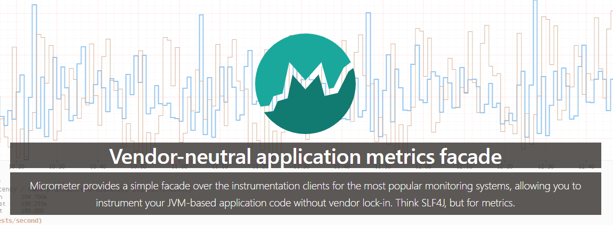

# Prometheus监控入门

Prometheus是一套开源的系统监控和告警框架。

## 组件架构

**Prometheus Server**：核心组件，用于收集和存储时间序列数据，使用pull方式拉取监控数据。内置时间序列数据库（TSDB），同时支持三方TSDB。支持PromQL（Prometheus Query Language），提供对时间序列数据的查询、聚合和逻辑运算能力。

**Exporters**：暴露HTTP数据采集接口，Prometheus Server定时调用接口采集监控数据。Exporter可以内置在应用程序内，通常能获得更详细的监控数据。对于无法内置Exporter的三方应用，由独立的程序对其进行观测，担任Exporter的职责。

**Push Gateway**：用于存活时间短的任务，这类任务将监控数据推送到Push Gateway，Prometheus Server仍通过pull方式从Push Gateway拉取数据。

**Alertmanager**：在Prometheus Server支持基于PromQL创建告警规则，满足告警条件后，向Alertmanager推送一条告警消息，由Alertmanager对告警消息进行处理，如发送邮件、短信等。

**Prometheus web UI**：数据可视化界面。


## 数据模型

```
http_server_requests_count{method="GET",status="200",uri="/actuator/prometheus",} 1.0
```

Prometheus将数据存储为**时间序列（time series）**，一条时间序列由**指标名称（metrics name）**和一组可选的**标签（labels）**唯一标识，由一系列带时间戳的值组成。时间序列表示形式：`<metric name>{<label name>=<label value>, ...}`。

指标名称反映监控数据的含义。指标名称只能由ASCII字母数字、下划线和冒号组成，并满足正则表达式`[a-zA-Z_:][a-zA-Z0-9_:]*`。

标签从多个维度表示数据特征，使用标签可以对时间序列进行过滤、聚合，从而产生新的时间序列，能灵活地从多个维度对数据进行观测。标签名称只能包含ASCII字母数字和下划线，并满足正则表达式`[a-zA-Z_][a-zA-Z0-9_]*`。

时间序列上每一个数据点称为**样本（Samples）**，样本包含以下要素：

- 指标名称和一组标签
- 64位浮点数值
- 精确到毫秒的时间戳

## 指标类型

从存储上来说，所有指标类型都是相同的，但在含义和使用场景上对指标进行了一些区分，Prometheus定义了四种不同的指标类型：Counter（计数器）、Gauge（仪表盘）、Histogram（直方图）、Summary（摘要）。

### Counter

Counter代表样本数据单调递增的指标，在程序重启后会重置为0。如接口请求次数。

### Gauge

Gauge代表样本数据可以任意变化的指标，侧重反映系统的当前状态。如已使用内存大小。

### Histogram

Histogram对观察对象（通常是请求时间和响应报文大小这类数据）进行数据采样，并将样本值分不同的区间进行计数。Histogram指标包含三条时间序列：

- 区间内样本的计数值，表示为`<basename>_bucket{le="<upper inclusive bound>"}`
- 观察对象样本值的总和，表示为`<basename>_sum`
- 观察对象样本的总数量，表示为`<basename>_count`

```
# HELP prometheus_tsdb_compaction_chunk_range Final time range of chunks on their first compaction
# TYPE prometheus_tsdb_compaction_chunk_range histogram
prometheus_tsdb_compaction_chunk_range_bucket{le="100"} 0
prometheus_tsdb_compaction_chunk_range_bucket{le="400"} 0
prometheus_tsdb_compaction_chunk_range_bucket{le="1600"} 0
prometheus_tsdb_compaction_chunk_range_bucket{le="6400"} 0
prometheus_tsdb_compaction_chunk_range_bucket{le="25600"} 0
prometheus_tsdb_compaction_chunk_range_bucket{le="102400"} 0
prometheus_tsdb_compaction_chunk_range_bucket{le="409600"} 0
prometheus_tsdb_compaction_chunk_range_bucket{le="1.6384e+06"} 260
prometheus_tsdb_compaction_chunk_range_bucket{le="6.5536e+06"} 780
prometheus_tsdb_compaction_chunk_range_bucket{le="2.62144e+07"} 780
prometheus_tsdb_compaction_chunk_range_bucket{le="+Inf"} 780
prometheus_tsdb_compaction_chunk_range_sum 1.1540798e+09
prometheus_tsdb_compaction_chunk_range_count 780
```

### Summary

和Histogram类似，Summary对观察对象（通常是请求时间和响应报文大小这类数据）进行数据采样，统计样本值总和和总数量。不同的是，它统计了样本数据的分位数，而不是区间分布计数。Summary包含以下三条时间序列：

- 样本的φ分位数，表示为`<basename>{quantile="<φ>"}`
- 观察对象样本值的总和，表示为`<basename>_sum`
- 观察对象样本的总数量，表示为`<basename>_count`

```
# HELP prometheus_tsdb_wal_fsync_duration_seconds Duration of WAL fsync.
# TYPE prometheus_tsdb_wal_fsync_duration_seconds summary
prometheus_tsdb_wal_fsync_duration_seconds{quantile="0.5"} 0.012352463
prometheus_tsdb_wal_fsync_duration_seconds{quantile="0.9"} 0.014458005
prometheus_tsdb_wal_fsync_duration_seconds{quantile="0.99"} 0.017316173
prometheus_tsdb_wal_fsync_duration_seconds_sum 2.888716127000002
prometheus_tsdb_wal_fsync_duration_seconds_count 216
```

## PromQL

PromQL是Prometheus内置的数据查询语言，其提供对时间序列数据丰富的查询、聚合以及逻辑运算能力的支持。

### 表达式语言数据类型

Prometheus包含四种类型的表达式：

- **瞬时向量（Instant vector）**：一组时间序列，每个时间序列包含单个样本，它们都有相同的时间戳。
- **区间向量（Range vector）**：一组时间序列，每个时间序列包含一段时间范围内的样本数据。
- **标量（Scalar）**：一个浮点型的数据值。
- **字符串（String）**：一个简单的字符串值。

### 时间序列选择器

#### 瞬时向量选择器

瞬时向量选择器选中一组时间序列和每条时间序列指定时间戳的一个样本值。直接使用指标名称查询，如`http_requests_total{}`，会返回该指标下所有时间序列。使用标签可以进一步过滤，如`http_requests_total{code="200"}`。

标签支持以下匹配方式：

- `=`：选择与提供的字符串完全相同的标签。
- `!=`：选择与提供的字符串不相同的标签。
- `=~`：选择正则表达式与提供的字符串相匹配的标签。
- `!~`：选择正则表达式与提供的字符串不匹配的标签。

#### 区间向量选择器

在瞬时向量选择器的基础上，增加了时间区间的选择，如`http_requests_total{}[5m]`，选中了最近5分钟的样本值。

时间单位：

- `s`：秒
- `m`：分钟
- `h`：小时
- `d`：天
- `w`：周
- `y`：年

时间位移操作offset。以上选择器都是以当前时间为基准，使用offset可以将时间基准往前挪。如`http_requests_total{}[5m] offset 1d`选中1天前5分钟内的样本值。

### 子查询

子查询能指定时间范围和分辨率（resolution）执行瞬时向量查询，查询结果是区间向量。

语法：`<instant_query> '[' <range> ':' [<resolution>] ']' [ offset <duration> ]`

### 运算符

#### 算术运算符

二元运算操作符支持 `scalar/scalar(标量/标量)`、`vector/scalar(向量/标量)`、和 `vector/vector(向量/向量)` 之间的操作。

- `+` 加法
- `-` 减法
- `*` 乘法
- `/` 除法
- `%` 模
- `^` 幂等

#### 布尔运算符

布尔运算符被应用于 `scalar/scalar（标量/标量）`、`vector/scalar（向量/标量）`，和`vector/vector（向量/向量）`。

- `==` (相等)
- `!=` (不相等)
- `>` (大于)
- `<` (小于)
- `>=` (大于等于)
- `<=` (小于等于)

#### 集合运算符

在两个瞬时向量之间进行集合操作。

- `and` (并且)

- `or` (或者)

- `unless` (排除)

#### 向量匹配

向量与向量之间进行运算操作时会基于默认的匹配规则：依次找到与左边向量元素匹配（标签完全一致）的右边向量元素进行运算，如果没找到匹配元素，则直接丢弃。

**一对一匹配**模式会从操作符两边表达式获取的瞬时向量依次比较并找到唯一匹配(标签完全一致)的向量。

在标签不一致的情况下，可以用`on(label list)` 或者 `ignoring(label list）`来修改需要匹配的标签。`on` 指定需要匹配的标签列表，`ignoreing` 则忽略不需要匹配的标签。

```
<vector expr> <bin-op> ignoring(<label list>) <vector expr>
<vector expr> <bin-op> on(<label list>) <vector expr>
```

**多对一和一对多**两种匹配模式指的是“一”侧的每一个向量元素可以与"多"侧的多个元素匹配的情况。在这种情况下，必须使用 group 修饰符：`group_left` 或者 `group_right` 来指定哪一个向量具有更高的基数（充当“多”的角色）。

```
<vector expr> <bin-op> ignoring(<label list>) group_left(<label list>) <vector expr>
<vector expr> <bin-op> ignoring(<label list>) group_right(<label list>) <vector expr>
<vector expr> <bin-op> on(<label list>) group_left(<label list>) <vector expr>
<vector expr> <bin-op> on(<label list>) group_right(<label list>) <vector expr>
```

#### 聚合运算

Prometheus 提供了内置的聚合操作符，这些操作符作用于瞬时向量。可以将瞬时向量返回的样本数据进行聚合，形成一个具有较少元素的新向量。

- sum (求和)
- min (最小值)
- max (最大值)
- avg (平均值)
- stddev (标准差)
- stdvar (标准差异)
- count (计数)
- count_values (对 value 进行计数)
- bottomk (样本值最小的 k 个元素)
- topk (样本值最大的k个元素)
- quantile (分布统计)

可以使用所有标签进行聚合，也可以使用`without`、`by`自定义聚合的标签维度。

```
<aggr-op> [without|by (<label list>)] ([parameter,] <vector expression>)
```

#### 运算符优先级

二元运算符优先级从高到低的顺序为：

1. `^`
2. `*`, `/`, `%`
3. `+`, `-`
4. `==`, `!=`, `<=`, `<`, `>=`, `>`
5. `and`, `unless`
6. `or`

具有相同优先级的运算符是左结合的。例如，`2 * 3 % 2` 等价于 `(2 * 3) % 2`。运算符 `^` 例外，`^` 满足的是右结合，例如，`2 ^ 3 ^ 2` 等价于 `2 ^ (3 ^ 2)`。

### 函数

Prometheus 提供了其它大量的内置函数，可以对时序数据进行丰富的处理。

`increase(v range-vector)` 函数获取区间向量中的第一个和最后一个样本并返回其增长量，只能用于Counter类型。`increase(http_requests_total{}[1m])`返回最近1分钟的请求增长量。

`rate(v range-vector)` 函数可以直接计算区间向量 v 在时间窗口内平均增长速率，只能用于Counter指标。如`rate(http_requests_total{}[1m])`返回最近1分钟的请求速率（请求数/秒）。

`irate(v range-vector)` 函数用于计算区间向量的增长率，但是其反应出的是瞬时增长率。irate 函数是通过区间向量中最后两个两本数据来计算区间向量的增长速率，这种方式可以避免在时间窗口范围内的“长尾问题”，并且体现出更好的灵敏度，通过irate函数绘制的图标能够更好的反应样本数据的瞬时变化状态。irate 只能用于绘制快速变化的计数器，形成的图形有很多波峰，在长期趋势分析或者告警中更推荐使用 rate 函数。

## Micrometer



> Micrometer provides a simple facade over the instrumentation clients for the most popular monitoring systems, allowing you to instrument your JVM-based application code without vendor lock-in. Think SLF4J, but for metrics.

Micrometer提供了通用的指标采集接口，屏蔽了监控系统的差异，是应用监控的SLF4J。内置多个应用系统的支持：**AppOptics**, **Azure Monitor**, Netflix **Atlas**, **CloudWatch**, **Datadog**, **Dynatrace**, **Elastic**, **Ganglia**, **Graphite**, **Humio**, **Influx/Telegraf**, **JMX**, **KairosDB**, **New Relic**, **Prometheus**, **SignalFx**, Google **Stackdriver**, **StatsD**, and **Wavefront**。

支持多维度指标，**timers**, **gauges**, **counters**, **distribution summaries**, and **long task timers**。

内置多种监控对象指标采集的实现，包括缓存、类加载器、垃圾回收、处理器利用率、线程池等。

### Registry

`Meter`是采集应用数据的指标接口。Registry创建并保存`Meter`，保存监控数据。每个监控系统都必须实现Registry的接口`MeterRegistry`。Prometheus server从Exporter拉取数据，Exporter再从Registry获取所有监控指标样本。

### Meters

Micrometer提供了多种类型的`Meter`，包括 `Timer`, `Counter`, `Gauge`, `DistributionSummary`, `LongTaskTimer`, `FunctionCounter`, `FunctionTimer`, and `TimeGauge`。

和prometheus一样，meter通过名称和一组标签唯一标识。

不同监控系统有不同的命名约定，micrometer指标名称约定使用`.`分隔小写单词。每个监控系统必须实现命名转换器，转换指标名称使其符合监控系统的约定。如micrometer的一个指标`registry.timer("http.server.requests");`，在prometheus中会转换为`http_server_requests_duration_seconds`。

标签命名推荐使用和指标名称相同的命名方式，即`.`分隔小写单词。

### Counters

计数器，如监控接口请求数量。

### Gauges

采集监控对象的当前值，如内存大小、运行中线程数量等。

### Timers

监控短时间事件的耗时和频率，如接口请求耗时和频率，在prometheus中会上报为接口耗时总和、接口请求总次数。可配置开启分位数统计、耗时区间分布统计，对应prometheus的Summary和Histogram指标类型。

### Distribution summaries

和Timers类似，但它采集的不是时间单位的数据，如接口响应体大小。同样可配置分位数统计、样本值区间分布统计。

### Long task timers

用于监控长时间运行的任务，跟踪正在运行的任务数量和任务总持续时间。可用于监控定时任务。