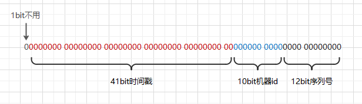

## 原理

雪花算法使用64bit表示一个唯一ID，第一位bit保留不用，接着41bit表示当前时间戳，10bit表示机器id，12bit自增序列号。最多能运行在2^10=1024台机器上，一台机器一毫秒能生成2^12=4096个ID，一秒就是400万个ID，扩展性和性能都很不错。

使用位移和或运算能高效计算ID，`时间戳 << 22 | 机器id << 12 | 序列号`。

## 优点

- 第一部分为时间戳，ID趋势递增，对使用了聚集索引的RDBMS，有序的主键保证了写入性能
- 可分布式部署
- 一秒400万个ID，效率高
- 不依赖三方服务组件，稳定性高

## 缺点

雪花算法的基本原理比较简单，但在实际应用中存在一些较难解决的问题。

- 强依赖机器时钟，如果发生时钟回拨，可能生成重复ID

## Leaf

[Leaf——美团点评分布式ID生成系统 - 美团技术团队](https://tech.meituan.com/2017/04/21/mt-leaf.html)

